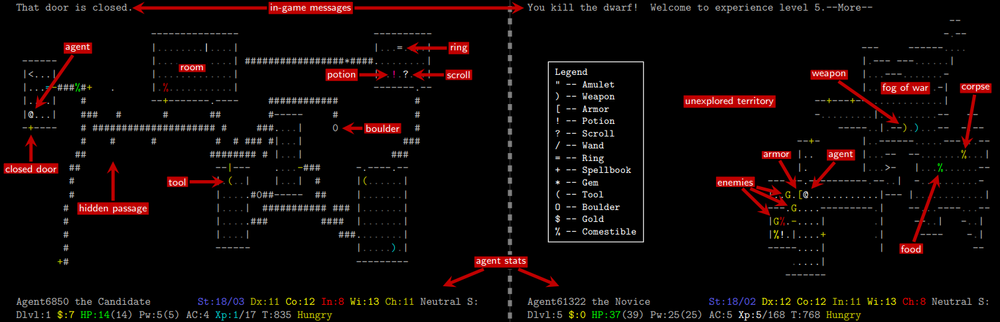
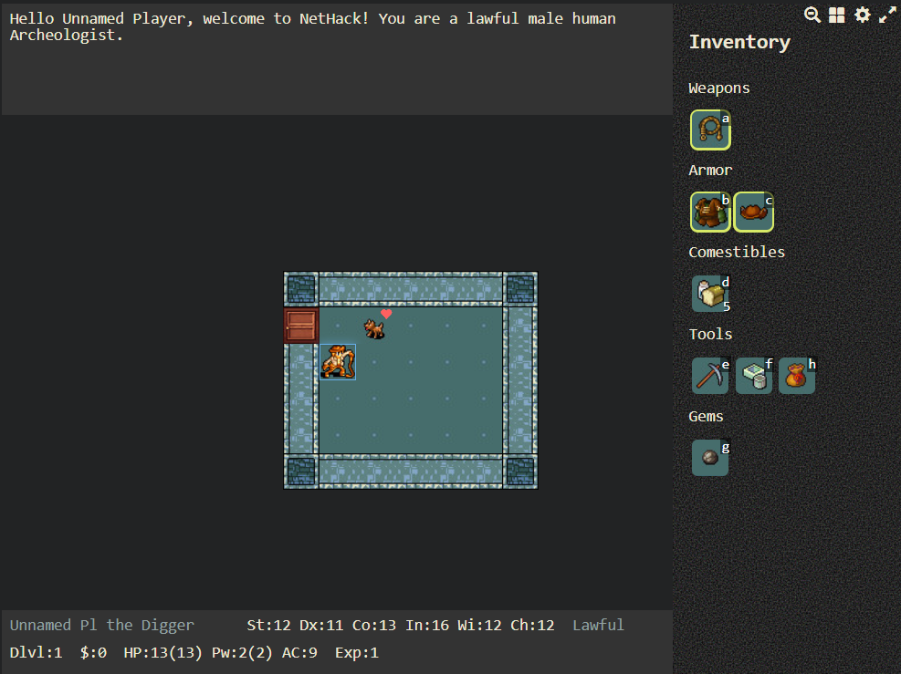
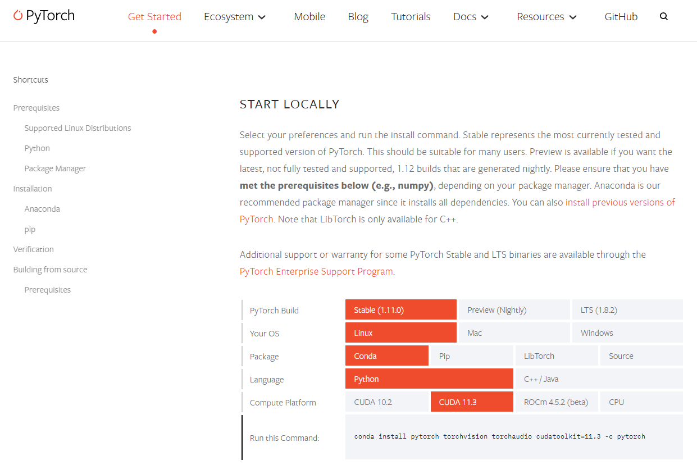

# Index
- [What is NetHack?](#what-is-nethack)
- [What is NetHack Learning Environment?](#what-is-nethack-learning-environment)
- [About NLE](#about-nle)
- [Evaluation](#evaluation)
- [Appendix](#appendix)
- [Reference](#reference)

# What is NetHack?
넷핵(NetHack)은 1987년에 처음 발표된 로그라이크 종류의 컴퓨터 게임으로, 1985년 발표된 핵(Hack)의 확장판이다. 아스키 코드로 표현되는 맵에서 캐릭터를 움직여 아이템을 획득하고 적들을 처치하며 던전을 탐험하는 것이 목표인 게임이다. 로그라이크 종류의 게임이 익숙하지 않다면, 최근 인기 있는 로그라이크 종류의 게임인 The Binding of Issac, Vampire Survivors을 떠올리면 어떤 종류의 게임인지 대략적으로 알 수 있을 것이다. 넷핵의 플레이 목표는 Amulet of Yendor를 얻어 신께 제공하여 승천하는 것이다. 플레이어는 이것을 획득하기 위해 캐릭터의 직업, 종족, 성별을 선택하여 던전을 탐험한다. 직업과 종족에 따라 플레이 전략이 크게 달라지기도 한다. 직업과 종족에 대한 자세한 정보는 [넷핵 공식 가이드북](https://github.com/NetHack/NetHack/blob/NetHack-3.6.6_PostRelease/doc/Guidebook.txt)([번역본](https://namu.wiki/w/%EB%84%B7%ED%95%B5/%EA%B0%80%EC%9D%B4%EB%93%9C%EB%B6%81#s-2))에 제공되어 있다.  



위 그림은 넷핵 게임 화면의 요소들을 간략하게 설명한 그림이다. 요소들에 대한 자세한 정보는 [넷핵 공식 가이드북](https://github.com/NetHack/NetHack/blob/NetHack-3.6.6_PostRelease/doc/Guidebook.txt)([번역본](https://namu.wiki/w/%EB%84%B7%ED%95%B5/%EA%B0%80%EC%9D%B4%EB%93%9C%EB%B6%81#s-3))에 제공되어 있다.
- 화면 상단에는 현재 상태를 알려주는 인게임 메시지가 제공된다.
- 화면 중단에는 21×79 크기의 아스키 코드로 표현되는 맵이 제공된다. 맵의 각 요소는 각각의 특수한 문자와 색으로 표현된다.
- 화면 하단에는 상태 표시줄이 제공된다. 캐릭터의 현재 상태를 설명하는 몇 가지 짧은 정보들이 제공된다.

로그라이크 게임의 특징 중 하나로 굉장히 높은 자유도와 게임 요소들 간의 수많은 상호작용이 존재한다. 이를 위해 다양한 조작 커맨드가 있는데, 넷핵은 77개의 command action과 16개의 movement action이 있다. 아이템 사용, 특수 행동에 관한 조작법까지는 기억할 필요가 없지만, 던전 탐험, 전투, 장비 관련에 관한 조작법은 기억해 두는 것이 좋다. 조작법에 대한 자세한 정보는 [넷핵 공식 가이드북](https://github.com/NetHack/NetHack/blob/NetHack-3.6.6_PostRelease/doc/Guidebook.txt)([번역본](https://namu.wiki/w/%EB%84%B7%ED%95%B5/%EA%B0%80%EC%9D%B4%EB%93%9C%EB%B6%81#s-4))에 제공되어 있다. 

<p align="center">
  
</p>

아스키 코드로 나타낸 화면이 불편할 유저들을 위해 아스키 코드를 이미지로 변환한 [BrowserHack](https://coolwanglu.github.io/BrowserHack/)도 존재한다. 게임 화면의 요소와 플레이 방법에 익숙해지기 위해, BrowserHack에서 게임을 직접 플레이 해보자. 

# What is NetHack Learning Environment?

NetHack Learning Environment([nle](https://github.com/facebookresearch/nle))는 facebook research가 NeurIPS 2020에서 공개한 강화학습 환경이다. 강화학습은 환경의 영향을 많이 받는데, 그 이유는 기존의 알고리즘이 새로운 환경에서는 적용되지 않을 가능성이 높기 때문이다. 새로운 환경에서도 적용되는 알고리즘을 찾기 위해 알고리즘의 발전이 이루어지고, 그렇기 때문에 강화학습에서는 좋은 환경을 찾는 것이 중요하다. 기존의 OpenAI Gym에서 제공하는 강화학습 환경은 비교적 deterministic하고 repetitive하여 새로운 환경에서도 적용되는 알고리즘을 찾기 어려웠다. 하지만 NLE는 단순한 규칙을 바탕으로 생성되는 환경이 수많은 변인을 내포하고 있어 non-deterministic하고 non-repetitive하여 강화학습을 위한 좋은 환경을 제공한다.  

NLE는 MacOS와 Linux에서만 설치가 가능하다. 별도 Linux PC가 없다면 WSL(Windows Linux Subsystem)을 이용할 수 있다. 본 문서에서 사용하는 환경은 Ubuntu 18.04 distribution이다. NLE를 설치하기 위해서는 3.5버전 이상의 Python, 3.15버전 이상의 CMake가 필요하다. Python Anaconda 배포판을 사용하는 것을 추천하며, 본문에서는 Python Anaconda 배포판을 사용하는 것을 기준으로 설명한다. MacOS나 Linux GUI 환경에서는 [Anaconda](https://www.anaconda.com/products/distribution)에서 64bit Python 3.9를 다운로드하여 설치한다. Linux 터미널에서는 아래 명령어를 입력하여 설치할 수 있다.

``` bash
$ wget https://repo.anaconda.com/archive/Anaconda3-2021.11-Linux-x86_64.sh
$ sh Anaconda3-2021.11-Linux-x86_64.sh
```

MacOS 터미널에서는 아래 명령어를 입력하여 Homebrew로 CMake를 설치할 수 있다.

``` bash
$ brew install cmake
```

Linux 터미널에서는 아래 명령어를 입력하여 설치할 수 있다.

```bash
# Python and most build deps
$ sudo apt-get install -y build-essential autoconf libtool pkg-config \
    python3-dev python3-pip python3-numpy git flex bison libbz2-dev

# recent cmake version
$ wget -O - https://apt.kitware.com/keys/kitware-archive-latest.asc 2>/dev/null | sudo apt-key add -
$ sudo apt-add-repository 'deb https://apt.kitware.com/ubuntu/ bionic main'
$ sudo apt-get update && apt-get --allow-unauthenticated install -y \
    cmake \
    kitware-archive-keyring
```

Anaconda와 CMake 설치가 완료되었다면, 아래 명령어를 통해 가상환경을 생성하고 NLE를 설치한다.

```bash
$ conda create -y -n nle python=3.9
$ conda activate nle
$ pip install nle
```

현재 최신 버전의 gym으로 NLE를 실행하면 오류가 발생한다. 따라서 gym 버전을 다운그레이드한 후에 NLE를 사용할 수 있다.

```bash
$ pip install gym==0.23.0
```

NLE를 설치했다면 아래 코드를 실행해 보자. OpenAI Gym을 사용할 때와 동일하게 사용하면 된다.

``` python
>>> import gym
>>> import nle
>>> env = gym.make("NetHackScore-v0")
>>> env.reset()  # each reset generates a new dungeon
>>> env.step(1)  # move agent '@' north
>>> env.render()
```

혹은 터미널에 특정 명령어를 입력하여 실행할 수도 있다. 참고로 Python에서 -m 옵션은 library module을 script처럼 실행하게 한다.

``` bash
# Play NetHackStaircase-v0 as a human
$ python -m nle.scripts.play

# Use a random agent
$ python -m nle.scripts.play --mode random

# Play the full game using directly the NetHack internal interface
# (Useful for debugging outside of the gym environment)
$ python -m nle.scripts.play --env NetHackScore-v0 # works with random agent too

# See all the options
$ python -m nle.scripts.play --help
```

첫 번째 명령어는 `/nle/scripts/play.py` 파일을 실행한다. 모드를 설정하지 않으면 기본적으로 human으로 되어 있기 때문에, 해당 명령어를 입력하면 사람이 직접 조작하는 넷핵 화면이 시작된다. `--mode` 옵션은 사람이 직접 조작하는 human 옵션과 매턴마다 무작위 action을 실행하는 random 옵션이 있다. 두 번째 명령어와 같이 random 옵션으로 실행하면 무작위로 action을 선택하는 모습을 볼 수 있다. `--env` 옵션은 task를 설정할 수 있다. 기본적으로 `NetHackScore-v0`가 설정되어 있고, 아래에서 소개할 다른 task로 변경할 수 있다. `--help` 옵션으로 다른 옵션을 확인할 수 있다. 이외 NLE에 대해 알아야 할 내용을 아래에 정리해 두었다.

# About NLE

NLE는 OpenAI Gym을 기반으로 만들어졌기 때문에, 기본적으로 action space와 observation space가 정해져있다. NLE에는 최대 90여개의 action이 존재하지만, 예제 환경에서는 빠르고 안정적인 학습을 위해 기본적인 23개의 action만을 사용한다. 물론 사용자가 원할 경우 action space를 확장할 수도 있다. 다음은 예제 환경에서 사용할 NLE의 기본 action과 action number를 정리한 표다.

|action number|action|
|---|---|
|0|More|
|1|북쪽으로 한 칸 이동|
|2|동쪽으로 한 칸 이동|
|3|남쪽으로 한 칸 이동|
|4|서쪽으로 한 칸 이동|
|5|북동쪽으로 한 칸 이동|
|6|남동쪽으로 한 칸 이동|
|7|남서쪽으로 한 칸 이동|
|8|북서쪽으로 한 칸 이동|
|9|북쪽으로 멀리 이동|
|10|동쪽으로 멀리 이동|
|11|남쪽으로 멀리 이동|
|12|서쪽으로 멀리 이동|
|13|북동쪽으로 멀리 이동|
|14|남동쪽으로 멀리 이동|
|15|남서쪽으로 멀리 이동|
|16|북서쪽으로 멀리 이동|
|17|계단 올라가기|
|18|계단 내려가기|
|19|한 턴 기다리기|
|20|발로 차기|
|21|먹기|
|22|수색하기|

NLE에서는 각 step 마다 observation을 제공한다. 다음은 예제 환경에서의 observation space의 중요 요소를 간단히 정리한 표다.

|요소 이름|요소 정보|범위|크기|
|---|---|---|---|
|blstats|캐릭터 상태를 수치화하여 나타냄|정수|26|
|glyphs|현재 보이는 맵의 각 요소(몬스터, 아이템 등)에 특정 숫자를 부여하여 나타냄|0~5976(```nethack.MAX_GLYPH```)|21×79|
|chars|현재 보이는 맵을 아스키 코드로 나타냄|0~255|21×79|
|colors|현재 보이는 맵의 각 요소들의 색상을 나타냄|0~15|21×79|
|specials|현재 보이는 맵에서 특별한 존재를 표시할 때 사용함|0~255|21×79|
|message|게임에서 출력되는 메시지를 아스키 코드로 나타냄|0~255|256|
|inv_glyphs|인벤토리의 각 요소에 특정 숫자를 부여하여 나타냄|0~5976|55|
|inv_strs|인벤토리의 각 요소를 설명|0~255|55×80|
|inv_letters|인벤토리의 각 요소에 대응되는 알파벳을 나타냄|0~255|55|
|inv_oclasses|인벤토리의 각 요소의 타입을 나타냄|0~18|55|
|tty_chars|현재 터미널에 출력되는 모든 요소를 아스키 코드로 나타냄|0~255|24×80|
|tty_colors|현재 터미널에 출력되는 모든 요소의 색상을 나타냄|0~15|24×80|

Observation space 중 blstats는 agent의 상태를 26개의 수치로 나타낸다. 다음은 그 중에서 구현에 참고할만한 중요 요소를 간단히 정리한 표다.

|요소 이름|요소 정보|
|---|---|
|0|X 좌표|
|1|Y 좌표|
|2|Strength %|
|3|Strength|
|4|Dexterity|
|5|Constitution|
|6|Intelligence|
|7|Wisdom|
|8|Charisma|
|9|In-game score|
|10|현재 체력|
|11|최대 체력|
|12|던전 깊이|
|13|골드|
|14|현재 에너지|
|15|최대 에너지|
|16|Armor Class|
|17|몬스터 레벨|
|18|경험치 레벨|
|19|경험치|
|20|시간|
|21|배고픔 상태|
|22|Carrying Capacity|

NLE는 특정 task를 설정하여 강화학습이 진행되도록 한다. 다음은 NLE에서 제공하는 task를 나타낸 표다. 설정된 task를 잘 수행하는 방향으로 action을 선택하여 실행하면 높은 reward가 제공되는 방식이다.

|Task|내용|
|---|---|
|Staircase|다음 던전으로 내려가는 길을 찾아 던전 레벨이 높아질 수록 높은 reward를 획득한다.|
|Pet|Pet을 데리고 다음 던전으로 내려가면 reward를 획득한다.|
|Eat|게임 내에서 배고픔 상태를 높게 유지할 수록 높은 reward를 획득한다.|
|Gold|골드를 많이 획득할 수록 높은 reward를 획득한다.|
|Scout|던전의 미확인 지역을 많이 탐색할 수록 높은 reward를 획득한다.|
|Score|In-game score를 많이 획득할 수록 높은 reward를 획득한다.|
|Oracle|넷핵의 게임 요소인 Oracle을 찾으면 reward를 획득한다.|
|[Challenge](https://github.com/facebookresearch/nle/blob/main/nle/env/tasks.py#L287)|Score task에서 action, observation space가 변형되었고, 캐릭터가 랜덤으로 배정된다.|

앞으로의 예제에서는 가장 기본적인 `NetHackScore-v0`을 사용하여 강화학습을 구현해 볼 것이다. 여기까지 정독을 완료했다면, 이제 예제를 보며 NLE와 친해지는 시간을 가져보도록 하자.

# Evaluation

제출한 agent의 성능 평가는 개별 참가 팀이 각자의 저장소(github repository)에 자신들이 구현한 agent를 push하면, 평가 시스템에서 이를 clone하여 평가하고 결과를 도출하도록 한다. 운영진에서는 결과 확인 후 일정 주기마다 본 저장소에 이를 공표한다. 모든 저장소는 비공개(private)를 원칙으로 하지만, 운영진이 평가 시스템으로 clone할 수 있도록 저장소를 운영진과 공유하도록 한다. 자세한 절차는 다음과 같다.

1. 팀마다 비공개 저장소를 만들고, 구현한 agent를 push한다. 한 저장소에 여러 버전의 agent를 push하거나, 플랫폼 코드, 학습 코드, 실험용 코드 등 다른 코드가 포함되어 있어도 괜찮지만, 한 번에 하나의 agent만 평가된다. 평가하려는 agent에서 사용하는 서브 모듈이나 데이터는 모두 ```agent.py```와 같은 폴더 안에 있어야 하며, 상대 경로로만 모듈을 import하거나 파일을 읽을 수 있다. 경로가 변경될 수 있으므로 절대 경로를 사용하는 것은 지양하도록 한다.

2. 아래처럼 평가하려는 {agent 이름 or 팀 이름}: {agent.py 파일 경로} 형식으로 ```agent_path.yaml``` 파일을 작성/수정하여 저장소에 추가한다.

``` bash
Example10: agents/example10/agent.py
```

3. 운영진에게 저장소의 접근 권한을 공유한다.

운영진은 평가 시스템을 주기적으로 실행하여 저장소에서 최신 agent를 clone하여 평가한다. 평가 결과는 NCF2022 저장소 eval_results 폴더에 저장한다. 구체적인 평가 스케쥴은 변경될 수 있지만, 일주일에 한번 이상 평가하는 것을 목표로 한다. 중간 결과는 최종 결과와 무관하다. 중간 결과는 주기적으로 삭제될 수 있다.

또한 예제에서는 `NetHackScore-v0`를 사용하지만, 평가에서는 `NetHackChallenge-v0`를 사용한다. 따라서 제출시에는 `NetHackChallenge-v0`로 학습한 모델을 제출해야 한다. 해당 task는 `NetHackScore-v0`와 작은 차이점들이 존재하기 때문에, [링크](https://github.com/facebookresearch/nle/blob/main/nle/nethack/actions.py)를 참고하여 차이점을 숙지하도록 한다.

# Appendix

## PyTorch

Python으로 머신러닝을 구현할 때, 가장 많이 사용하는 프레임워크로 Tensorflow와 PyTorch가 있다. 각각의 장단이 존재하지만, 본문에서는 조금 더 직관적으로 모델을 구현할 수 있고 디버깅이 쉬운 PyTorch를 사용할 것이다. PyTorch를 설치하기 위해서는 [공식 홈페이지](https://pytorch.org/get-started/locally/)에서 자신의 환경에 알맞은 버전을 설치하면 된다. 본문에서는 첨부한 사진과 동일하게 설치하고자 하였다. 



```bash
(nle) ~/NCF2022$ conda install pytorch torchvision torchaudio cudatoolkit=11.3 -c pytorch
```

## Tensorboard

작성한 모델의 성능을 알아보기 위해 loss, reward 등 성능과 관련된 값들의 추이를 확인하고 싶을 때가 있을 것이다. print를 사용하여 값들을 직접 확인하는 것도 좋지만, 그래프를 통해 직관적으로 파악하고 싶다면 TensorBoard를 사용하는 것이 좋다. NLE는 PyTorch를 기반으로 작동되는 라이브러리이기 때문에, PyTorch에서 TensorBoard를 사용하는 방법을 알아보도록 하자.

``` python
import torch
from torch.utils.tensorboard import SummaryWriter
writer = SummaryWriter()
```

PyTorch로 Tensorboard를 사용하기 위해서는, 먼저 ```SummaryWriter``` 인스턴스를 생성해야 한다. 우리의 환경에서 Writer는 기본적으로 ```~/NCF2022/runs/``` 디렉토리에 데이터를 저장할 것이다. 다음으로 필요한 값을 기록하려면 ```add_scalar(tag, scalar_value, global_step=None, walltime=None)```함수를 사용해야 한다. 다음 예시는 간단한 linear regression 모델을 만들고 ```add_scalar``` 를 사용해 loss 값을 기록하는 것을 보여준다.

``` python
x = torch.arange(-5, 5, 0.1).view(-1, 1)
y = -5 * x + 0.1 * torch.randn(x.size())

model = torch.nn.Linear(1, 1)
criterion = torch.nn.MSELoss()
optimizer = torch.optim.SGD(model.parameters(), lr = 0.1)

def train_model(iter):
    for epoch in range(iter):
        y1 = model(x)
        loss = criterion(y1, y)
        writer.add_scalar("Loss/train", loss, epoch)
        optimizer.zero_grad()
        loss.backward()
        optimizer.step()

train_model(10)
writer.flush()
```

모든 보류중인(pending) 이벤트가 디스크에 기록되었는지 확인하려면 ```flush``` 함수를 호출하면 된다. 기록할 수 있는 더 많은 TensorBoard 시각화 방법을 찾으려면 [torch.utils.tensorboard tutorials](https://pytorch.org/docs/stable/tensorboard.html)을 참조하라. Summary writer가 더 이상 필요하지 않으면 ```close``` 함수를 호출한다.

``` python
writer.close()
```

TensorBoard를 실행하기 위해서는, 우선 TensorBoard를 설치하도록 한다. 이때 conda 가상환경 내에서 설치하는 것을 권장한다.

``` bash
(nle) ~/NCF2022$ pip install tensorboard
```

TensorBoard는 .*tfevents.* 파일을 찾기 위해 logdir의 인자로 받은 디렉터리 구조를 재귀적으로 탐색한다. NCF2022 디렉토리에서 다음 명령어를 입력하자.

``` bash
(nle) ~/NCF2022$ tensorboard --logdir=runs
```

이제 [http://localhost:6006](http://localhost:6006)으로 이동하여 시각화된 데이터를 확인할 수 있다.

## CUDA

만약 GPU를 사용할 수 있는 환경이라면, 학습에서는 GPU를 사용하는 것이 더욱 효과적이다. 머신러닝은 대부분의 과정에서 단순한 사칙연산만을 수행하는데, GPU는 그러한 연산들을 쉽게 병렬화하여 한 번에 여러 코어에서 계산이 가능하다. 그렇기 때문에 머신러닝에서는 GPU를 사용하여 보다 효율적으로 연산을 수행할 수 있다. PyTorch에서는 CUDA를 설치하여 GPU를 사용할 수 있다. CUDA를 설치하기 위해서 우선 WSL 버전을 확인하도록 한다. 만약 WSL2가 아닌 WSL1을 사용하고 있다면, WSL2으로 업그레이드 해야 한다. WSL2 설치 및 업그레이드 방법은 [마이크로소프트 공식 문서](https://docs.microsoft.com/ko-kr/windows/wsl/install)를 참고하도록 하자.

이제 CUDA를 설치하기 위해 [NVIDIA CUDA on WSL driver](https://developer.nvidia.com/cuda/wsl)를 설치한다. Get CUDA Driver을 눌러 자신의 사양에 알맞게 드라이버를 설치하도록 한다.

다음으로는 CUDA toolkit을 설치하기 위해 다음 명령어를 터미널에 순서대로 입력하도록 한다.

``` bash
(nle) ~/NCF2022$ wget https://developer.download.nvidia.com/compute/cuda/repos/wsl-ubuntu/x86_64/cuda-wsl-ubuntu.pin
(nle) ~/NCF2022$ sudo mv cuda-wsl-ubuntu.pin /etc/apt/preferences.d/cuda-repository-pin-600
(nle) ~/NCF2022$ wget https://developer.download.nvidia.com/compute/cuda/11.7.0/local_installers/cuda-repo-wsl-ubuntu-11-7-local_11.7.0-1_amd64.deb
(nle) ~/NCF2022$ sudo dpkg -i cuda-repo-wsl-ubuntu-11-7-local_11.7.0-1_amd64.deb
(nle) ~/NCF2022$ sudo apt-get update
(nle) ~/NCF2022$ sudo apt-get -y install cuda
```

설치가 잘 되었는지 확인하기 위해, 다음 코드를 실행하도록 해보자.

``` python
>>> import torch
>>> torch.cuda.is_available()
True
```

다음과 같은 결과를 얻었다면, 설치가 잘 완료된 것이다.

# Reference
[1] NetHack. 2020. NetHack. https://github.com/NetHack/NetHack/tree/NetHack-3.6.6_PostRelease. (2022).  
[2] facebookresearch. 2022. nle. https://github.com/facebookresearch/nle. (2022).  
[3] coolwanglu. 2018. BrowserHack. https://github.com/coolwanglu/BrowserHack. (2022).  
[4] [Küttler, Heinrich, et al. “The NetHack Learning Environment” arXiv preprint arXiv:2006.13760 (2020)](https://arxiv.org/abs/2006.13760)  
[5] [PYTORCH로 TENSORBOARD 사용하기](https://tutorials.pytorch.kr/recipes/recipes/tensorboard_with_pytorch.html)  
[6] [CUDA on WSL User Guide](https://docs.nvidia.com/cuda/wsl-user-guide/index.html)  
