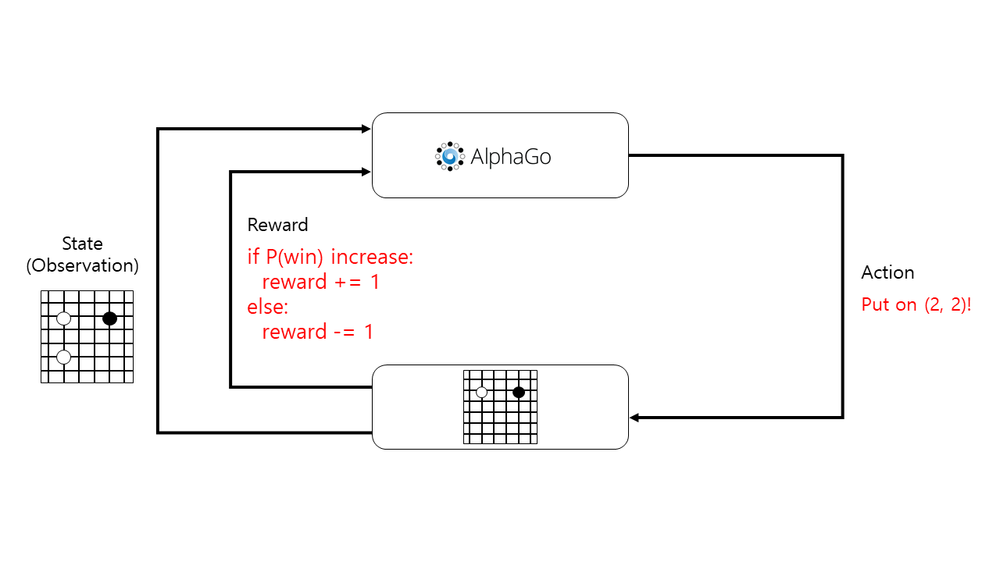

# 첫 번째 예제
<p>
  
  
</p>  

강화학습은 어떤 환경(environment) 안에서 정의된 객체(agent)가 현재의 상태(state, observation[^1])를 인식하여, 선택 가능한 행동(action)들 중 보상(reward)을 최대화하는 행동을 선택하는 방법을 말한다. 이때 보상을 최대화한다는 것은 해당 agent가 어떤 action을 통해 정의된 환경의 목표에 가까워진다는 것을 의미한다. 예를 들어, 바둑이라는 환경에서 정의된 알파고는 현재 판 위에 놓여져있는 수를 인식하여 환경의 목표인 승리에 가까워질 수 있는 최적의 수를 선택하도록 한다. 상태, 행동, 목표를 어떻게 정의할지, 이 값들을 어떻게 처리하여 행동을 선택할지 등에 따라서 다양한 방식으로 AI를 구현할 수 있다.

처음으로 소개하는 예제는 가장 간단한 예를 보여준다. ```agent.py``` 파일을 확인해보면, 클래스 ```Agent```는 ```ExampleAgent```를 상속 받는다. ```Agent``` 내의 ```get_action``` 함수는 환경(```env```), 그리고 인식된 현재 상태(```obs```)에 대한 정보를 받아 1부터 16까지의 숫자 중 하나를 무작위로 선택하여 반환한다. ```ExampleAgent.py```와 ```run.py``` 파일에서는 agent가 정의된 ```get_action``` 함수로부터 어떤 행동을 선택할지 받아와 그 행동을 수행하고, 환경으로부터 새로운 상태를 인식하여 다시 agent에게 알려준다. 앞으로 AI를 구현할 때는 모두 이와 같은 방식으로 ```ExampleAgent```를 상속한 뒤, ```__init__```, ```get_action``` 등의 메소드를 오버라이딩해서 구현하게 될 것이다.

이번 경진대회에서는 운영 편의상 AI 객체의 이름은 ```Agent```로 하고, 파일 이름은 ```agent.py```, 해당 AI와 관련된 모든 파일은 ```agents``` 폴더의 서브폴더에 저장한다. 예를 들어 내가 제출하는 객체의 이름이 My Agent라면, 관련 코드 및 데이터를 ```agents/my_agent``` 폴더에 저장하고, ```ExampleAgent``` 클래스를 상속한 클래스는 ```agents/my_agent/agent.py``` 파일에 ```Agent```로 한다. (디렉토리에 예시 파일을 생성해 두었다.)

이 예제를 실행하려면 다음 명령어를 터미널에서 입력하도록 하자.

```
(nle) ~/NCF2022$ python run.py --run agents.example01
```

처음 안내문에서 확인할 수 있듯이 1부터 16까지의 행동은 단순한 이동만 수행하기 때문에, 실행을 해보면 여러 문제점을 발견할 수 있다. More action이 입력되어야 다음 턴으로 넘어가는 경우, 이 예제에서는 More이 입력되지 않기 때문에 더 이상 진행이 되지 않는다. 또한 action이 완전히 무작위로 결정되기 때문에 길을 헤매거나, 앞에 문이 있는 경우 문을 열지 못한다는 등의 문제가 발생한다.

[^1]: State는 environment의 상태에 대해 완전히 알려주는 표현(fully observed)이고, observation은 정보가 생략되어 있을 수 있는 상태의 부분적인 표현(partially observed)이다.