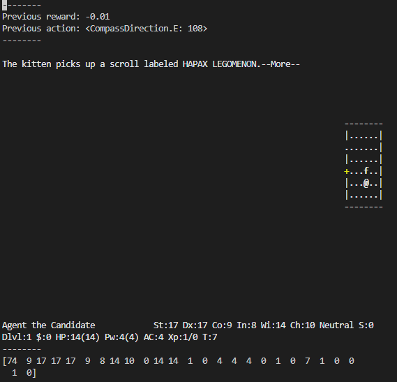
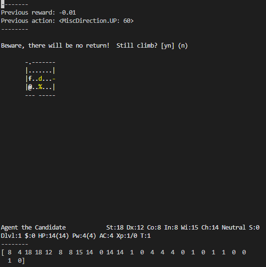
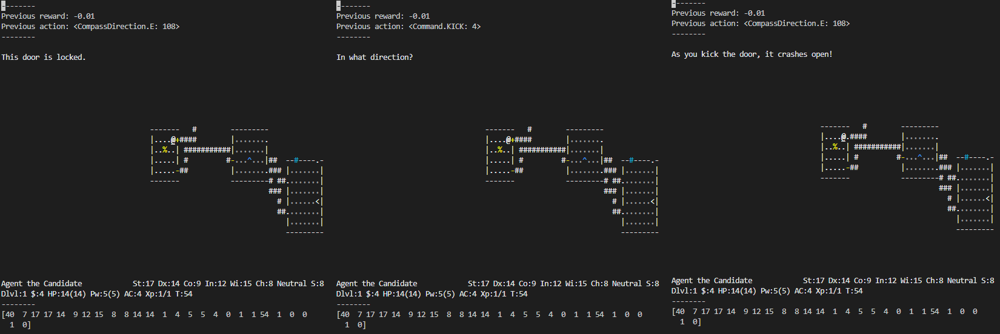

# 두 번째 예제

첫 번째 예제에서 실행 중 발생하는 다양한 문제점을 확인했다. 해당 문제점들의 공통점은 action을 무작위로 선택한다는 것에서 기인한다.

사람이 NetHack을 플레이할 때는 자신만의 규칙을 가지고 현재 상황을 근거로 하여 알맞은 action을 판단하여 선택한다. 예를 들어, 탐색을 하다 내려가는 계단을 발견하면 더 이상 다른 곳은 탐색하지 않고 곧바로 내려가는 action을 선택하는 규칙을 세워 플레이를 할 수 있다. 한 번 지나간 곳은 기억해 두었다가 다시 지나가지 않음으로써 헤매는 경우를 크게 줄일 수도 있다. 이렇듯 사람은 action을 무작위로 결정하지 않고, 현재 자신의 상황을 바탕으로 다음 action을 판단하여 선택한다. 또한 어떤 상황에는 반드시 선택해야하는 action이 있다. 이동하던 중 in-game message에 More가 나타난다면 다음 action으로 이동 관련 action이 아닌 More action을 선택해야 게임이 진행된다.

두 번째 예제에서는 agent가 자신의 상태를 바탕으로 다음 action을 판단하여 결정하도록 구현하였다. 여전히 이동에 관련해서는 1부터 16까지의 action 중에서 무작위로 고르지만, 특정 action이 필요한 경우를 판단하여 해당 경우에는 필요한 action을 적절히 선택한다. 다음 상황을 보자.



펫이 스크롤을 획득하였고, 스크롤에 대한 자세한 정보를 확인하기 위해 more action을 입력해야 한다. 이 상황에서는 기타 다른 action을 입력하여도 게임이 진행되지 않으며, more action을 입력해야만 게임이 진행되기 때문에 해당 상황을 인지할 필요가 있다. 다음 상황을 보자.



게임 내에서는 특정 action을 선택하였을 때, 해당 action을 정말 실행할 건지 한 번 더 묻는 문구가 출력되곤 한다. 이때도 마찬가지로 y와 n를 제외한 기타 다른 action을 입력하여도 게임이 진행되지 않는다. 따라서 해당 상황 또한 인지할 필요가 있다. 다음 상황을 보자.



agent가 게임을 진행하다 잠긴 문을 만났다. 이때 다른 길로 돌아가는 방법을 택할 수도 있지만, 잠긴 문 너머에 가보지 못한 길이 있을 수 있고, 돌아가는 방법은 그다지 효율적이지 못하다. 그렇기 때문에 이 상황에서는 문을 발로 차는 action을 통해 부수기를 시도해볼 가치가 있다. 이렇듯 특정 상황에서는 해당 상황을 인지하고 특정 action을 선택할 필요가 있다. 모든 경우에 대한 대처는 할 수 없겠지만, 이번 예제에서는 위에서 소개한 경우에 대한 대처를 시도한다.

```agent.py```의 ```get_action``` 함수를 참고하자. 인자로 받은 observation(```obs```)으로부터 agent의 현재 위치(line 10)와 현재 터미널에 출력되는 모든 요소(line 11)를 받아온다. 이후 ```ExampleAgent```에 정의된 ```is_more```, ```is_yn```, ```is_locked```, ```asking_direction``` 함수를 통해 각 상황에 대해 적절한 action을 선택하도록 한다.

이 예제를 실행하려면 다음 명령어를 터미널에서 입력하도록 하자.

```
(nle) ~/NCF2022$ python run.py --run agents.example02
```