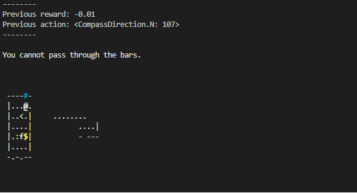

# 세 번째 예제

앞선 두 예제에서 무작위 이동에 대한 문제점을 확인할 수 있었다. 무작위 이동으로 인해 방문한 곳을 기억하지 못하고 계속해서 다시 방문하거나, 이동할 수 없는 경우에도 이동을 함으로써 시간을 낭비하게 된다. 시간에 따른 페널티가 존재하기 때문에 이러한 불필요한 낭비는 반드시 줄여야 한다. 하지만 넷핵의 맵에는 다양한 요소들이 있기 때문에 간단한 규칙조차도 적용하기가 어렵다. 그렇기 때문에 우선 맵 정보를 사용자가 사용하기 쉽게 하는 전처리 과정을 포함하면 이후 규칙을 적용하기 용이할 것이다. 이번 예제에서는 observation에서 받아온 맵 정보를 단순히 갈 수 있는 곳과 그렇지 않은 곳으로 구분하는 전처리 과정을 포함했다. 필요에 따라 전처리 과정을 수정해도 좋을 것이다.

```agent.py```의 ```get_action``` 함수와 ```preprocess_map``` 함수를 참고하자. 이전의 예제에서 인지한 특정 경우가 아니라면, 전처리 과정 후 이동 규칙을 적용하여 action을 선택하려고 한다. 이때 우리는 맵에 대한 정보를 바탕으로 판단하여 action을 선택하려고 하기 때문에, action을 선택하기 전(line 35)에 전처리 과정을 포함하도록 한다. ```preprocess_map``` 함수의 원형은 ```ExampleAgent```에 정의되어 있지만, 이 함수를 사용하기 위해서는 반드시 오버라이딩하여 작성해야 한다. ```preprocess_map``` 함수는 현재 observation의 맵 정보를 받아온 후 모든 좌표를 탐색하며 해당 좌표가 바닥, 통로처럼 이동할 수 있는 곳이라면 True, 공백, 바위, 벽 등 이동할 수 없는 곳이라면 False로 변환한다. line 72~73의 경우는 아래 상황을 고려하여 추가해주었다.



```get_action``` 함수에서는 기존 맵 정보에 함수를 적용한 후, 이동이 가능한 방향일 때만 해당 방향으로 이동하도록 코드를 작성하였다. 하지만 이대로 실행하면 일정 구간에만 머무르는 문제가 발생한다. 이 문제가 발생하는 이유를 생각해보고, 어떻게 해결할지 고민해보자.

이 예제를 실행하려면 다음 명령어를 터미널에서 입력하도록 하자.

```
(nle) ~/NCF2022$ python run.py --run agents.example03
```