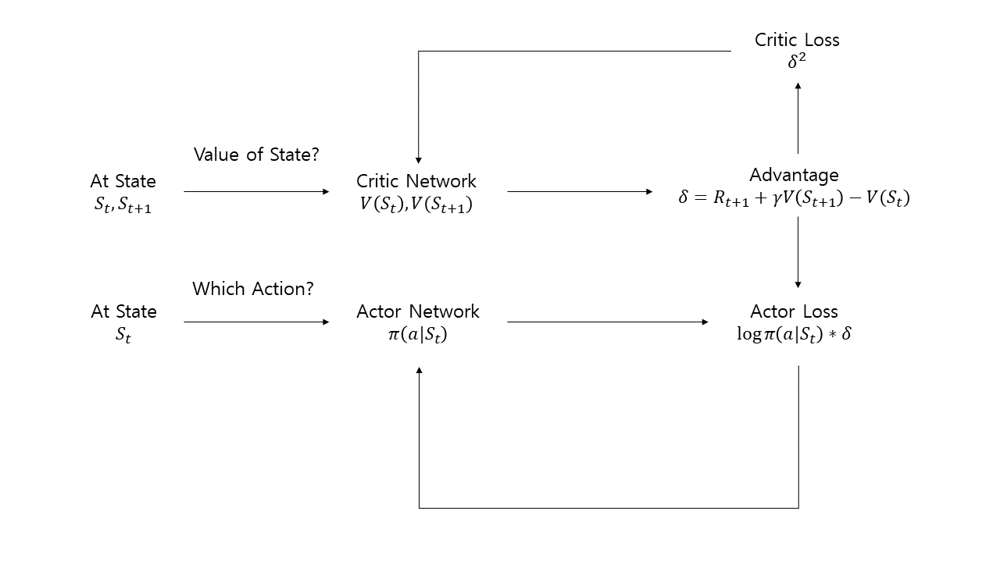
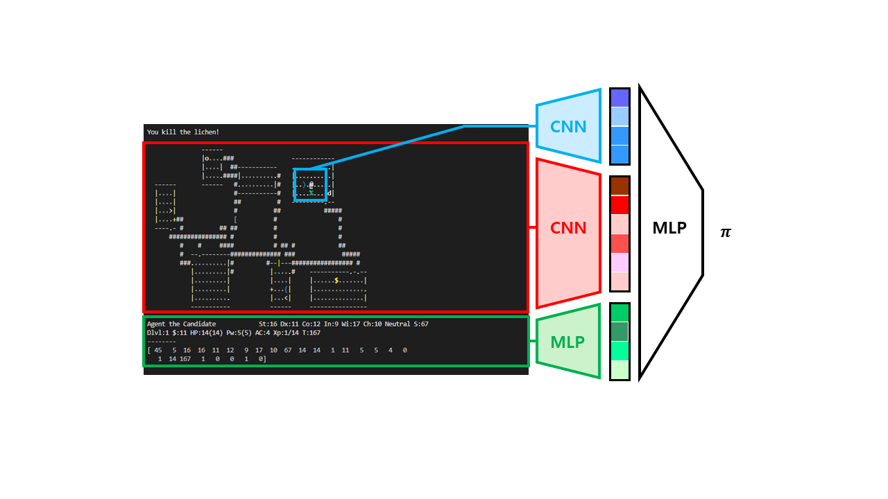

# 여섯 번째 예제

DQN은 현재 state에서 취할 수 있는 action의 가치(Q value)를 계산하여 가치가 가장 높은 action을 선택하는 방식으로 action을 결정한다. 이러한 방법을 가치 기반 방식이라고 한다. 이와 구분되는 강화학습 방식으로, 현재 state에서 어떤 action을 선택할지 확률적으로 계산하는 정책 기반 방식이 있다. 대표적으로 Actor-Critic이 있다. 이번 예제에서는 정책 기반 방식 중 하나인 Advantage Actor-Critic으로 action을 선택하는 모델을 구현한다.

DQN에서 Neural Network는 현재 state와 action을 입력 받아 계산된 Q 값을 출력한다. Q 값은 학습 과정에서 어떤 state에서 어떤 action을 선택했을 때 획득하는 reward를 바탕으로 계산되고, action을 선택할 때 Q 값이 가장 높은 action을 선택한다. 초기에는 Q 값이 제대로 학습되어있지 않기 때문에 exploration을 통해 최적의 Q 값을 찾아 나가고, 학습이 진행됨에 따라 exploration rate를 줄여나간다.



Actor-Critic에서 Neural Network는 현재 state를 입력 받아 각 action을 선택할 확률 분포를 출력하는 Actor network, 학습 과정에서 필요한 loss 계산을 위해 현재 state와 다음 state를 입력 받아 각 state의 가치를 계산하는 Critic network로 이루어져 있다. Neural Network의 출력 값이 확률 분포이기 때문에 epsilon-greedy policy와 같은 random exploration이 필요하지 않고, 학습 과정에서 학습된 확률 분포에 따른 탐험을 진행하게 된다. Actor-Critic은 state의 가치를 계산할 때 근사를 사용하는데, 이러한 근사는 결과값의 분산을 크게 만든다는 문제점이 존재한다. 이를 해결하기 위해 baseline이라는 것을 사용하는데, 이때 baseline으로 advantage 함수를 사용하는 방법을 Advantage Actor-Critic(이하 A2C)라고 한다. 위 그림은 Actor-Critic을 도식화한 그림이다. 이제 이를 NLE에서 구현하는 방법을 알아보자.



```a2c.py```에는 A2C 모델이 구현되어 있다. 이해를 쉽게 하기 위해 이전 예제에서 사용한 CNN과 FC Layer 구조를 거의 그대로 사용하였다. ```forward``` 함수에서 actor, critic을 반환하는데, 이는 앞에서 설명했듯이 각각 actor network와 critic network를 의미한다.

```agent.py```에는 이전 예제와 마찬가지로 학습에 관한 함수들이 정의되어 있다. 하지만 이전 예제와 다르게 한 가지 주의할 점은, 모델에서 첫 번째 인자로 반환되는 값을 확률밀도함수 형태로 사용해야 한다는 것이다. 따라서 신경망의 결과값을 ```softmax``` 함수를 사용하여 확률밀도함수로 변환한 뒤, ```torch.multinomial``` 함수를 사용하여 action을 선택하고, 이후 필요에 맞추어 ```unsqueeze```, ```squeeze``` 등을 적절히 활용해야 한다. 이후 일정 주기마다 매 step으로부터 저장된 actor, action, critic, reward, done 정보를 이용하여 학습을 진행한다. 학습에서는 학습의 안정화를 위해 gradient clipping을 적용하였다. 또한 일반적인 A2C 알고리즘에는 entropy의 개념이 없는데, 이는 OpenAI Baseline의 A2C 구현에서 기존 A2C 알고리즘이 training 과정이 불안하고 overfitting이 쉽게 일어난다는 문제점을 해결하기 위해 제시한 방법 중 하나이다. Policy distribution의 entropy를 loss에 추가하여 action의 다양성을 유지해주기 위해 노력하는 것으로 생각할 수 있다. 또한 A2C는 experience replay를 사용하지 않고 exploration을 통해 얻은 데이터를 즉시 사용하기 때문에, 여러 환경에서의 데이터를 동시에 사용할 수 있다면 조금 더 좋은 학습 결과를 기대할 수 있다. 따라서 gym의 [vector environment](https://tristandeleu.github.io/gym/vector/)를 사용하여 ```num_envs```만큼의 환경에서 동시에 데이터를 수집하였으며, 학습 환경의 메모리 크기에 따라 적절히 각 환경의 크기를 조절하였다.

DQN은 experience replay를 사용함으로써 데이터 간의 독립성을 보장하였지만, A2C는 탐색 데이터를 바로 학습에 이용하기 때문에 잘못된 길로 학습했을 경우 결과가 좋지 않을 수 있다. 이러한 문제를 해결하기 위해 비동기적으로 agent들을 학습하는 [Asynchronous Advantage Actor-Critic](https://arxiv.org/pdf/1602.01783.pdf)(이하 A3C)가 있다. 이외에도 A2C의 policy update 과정에서 성능이 악화되지 않도록 알고리즘을 개선한 [Trust Region Policy Optimization](https://arxiv.org/pdf/1502.05477.pdf)(이하 TRPO), 성능은 좋지만 복잡하다는 단점을 가진 TPRO을 조금 더 간단하게 만든 [Proximal Policy Optimization](https://arxiv.org/pdf/1707.06347.pdf)(이하 PPO) 등의 최신 Actor-Critic 알고리즘들이 존재한다.

이 예제를 실행하려면 우선 다음 명령어를 터미널에 입력하여 학습을 통해 policy.pt 파일을 생성해야 한다.

```
(nle) ~/NCF2022$ python run.py --run agents.example06 --mode train
```

학습 후 폴더 내에 policy.pt 파일이 생성되었다면, 다음 명령어를 터미널에 입력하여 실행할 수 있다.

```
(nle) ~/NCF2022$ python run.py --run agents.example06
```