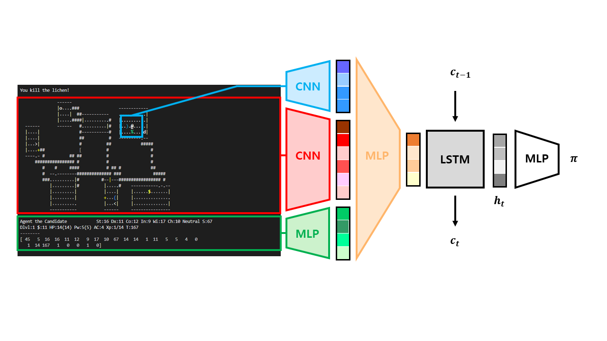

# 일곱 번째 예제

사람이 게임을 플레이할 때는 수많은 이전 state에 대한 정보를 바탕으로 다음 action을 선택한다. 하지만 DQN의 특성 중 하나는 state간의 독립성을 보장하기 위해 experience replay를 사용하는 것이다. 또한 A2C는 최근의 state에만 영향을 받기 때문에, 잘못된 길로 학습할 경우 결과값이 좋지 못하게 나오는 등 학습이 안정적이지 않다. 이러한 방식은 사람이 게임을 플레이하는 방식과는 차이가 존재한다. Recurrent Neural Network(이하 RNN)은 이러한 문제를 해결하고자 하는 구현이다.

기존 Neural Network에서는 학습이 독립적이라고 가정하지만, 음성 인식, 언어 모델링, 번역, 이미지 주석 생성 등 이전의 정보가 현재에도 의미가 있는 경우에는 순차적으로 과거의 정보를 반영할 수 있는 모델이 필요하다. RNN에서 하나의 layer는 이전 state와 현재 state를 input으로 받아 layer에서 지정한 연산을 수행한다. Output은 사용자에게 제공됨과 동시에 다음 state와 함께 다음 layer에 input으로 들어간다. 이러한 RNN의 특성은 앞에서 소개한 것과 같은 문제를 해결하는데 도움을 줄 수 있다.

Long Short-Term Memory Network(이하 LSTM)은 RNN의 한 종류로, 기본적인 RNN의 layer는 단순한 구조를 가지고 있는 반면 LSTM은 긴 의존 기간을 필요로 하는 학습을 수행할 수 있도록 비교적 복잡한 구조를 가진다. 단순한 구조의 layer는 state 간의 시간 격차가 커질 수록 [vanishing gradient](https://ko.wikipedia.org/wiki/%EA%B8%B0%EC%9A%B8%EA%B8%B0_%EC%86%8C%EB%A9%B8_%EB%AC%B8%EC%A0%9C) 문제가 발생하여 학습을 이어나가기 어렵다. 이를 해결하기 위해 layer의 구조를 변경한 것이 LSTM이다. 본문에서 LSTM의 구조에 대해 자세하게 설명하지 않지만, 관심이 있다면 [관련 자료](http://www.incodom.kr/LSTM)를 찾아보는 것을 추천한다. 이번 예제에서는 A2C에 LSTM을 추가한 A2C-LSTM 모델을 구현한다.



```a2c-lstm.py```에서 확인할 수 있듯이, A2C-LSTM을 구현하는 방법은 이전 예제에서 A2C 클래스를 선언할 때 LSTM layer를 추가하면 된다. 이때 LSTM layer는 short-term state, long-term state 인자를 추가로 받기 때문에 ```forward``` 함수의 모양을 필요에 맞게 바꾸어준다.

```agent.py```에서는 ```__init__```, ```get_actor_critic``` 함수를 수정한다. ```__init__``` 함수에서 short-term state를 나타내는 ```h_t```와 long-term state를 나타내는 ```c_t```를 zeros로 초기화한 후, ```get_actor_critic``` 함수에서 이를 업데이트하도록 한다. 이외에는 A2C 구현과 완전히 동일하다.

이 예제를 실행하려면 우선 다음 명령어를 터미널에 입력하여 학습을 통해 policy.pt 파일을 생성해야 한다.

```
(nle) ~/NCF2022$ python run.py --run agents.example07 --mode train
```

학습 후 폴더 내에 policy.pt 파일이 생성되었다면, 다음 명령어를 터미널에 입력하여 실행할 수 있다. 이때 LSTM을 사용하는 모델이기 때문에, use_lstm 옵션을 추가해야 한다.

```
(nle) ~/NCF2022$ python run.py --run agents.example07 --use_lstm
```