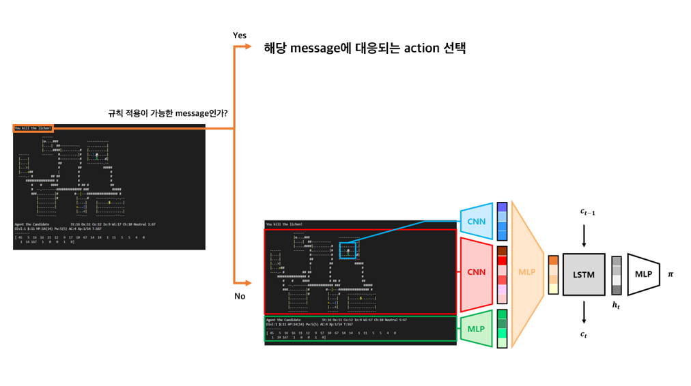

# 여덟 번째 예제

현재 신경망에서는 입력으로 현재 state의 전체 glyph, 현재 state의 전체 glyph에서 agent의 주변만 crop한 glyph, 현재 state의 blstat 정보를 이어 붙여 사용하기 때문에 in-game message가 주는 정보들은 action을 선택할 때 사용되지 않는다. 하지만 실제 플레이에서는 해당 정보 또한 action을 선택할 때 중요한 근거가 될 수 있다. In-game message는 사람이 이해하기 쉬운 글의 형태로 나오고, 경우의 수 또한 많지 않다는 특징이 있다. 따라서 이를 또 다른 입력값을 주어 학습시키는 것보다는 예제 2, 3, 4번에서와 같이 이에 대한 규칙을 만들어 따로 처리하는 것으로 성능 향상을 기대해볼 수 있다. 이번 예제에서는 강화학습을 기반으로 하되, 특정 상황에서는 규칙을 기반으로 action을 선택하는 모델을 구현한다. 아래는 모델의 구조를 나타낸 그림이다.



```agent.py```에서는 ```action_preprocess``` 함수를 만들고, ```get_action``` 함수와 ```train```함수를 수정한다. ```action_preprocess``` 함수에서는 screen 등의 여러 정보를 읽어와 규칙을 적용할 수 있는 특정 상황이라면 규칙에 따른 action을 반환한다. Agent의 action 선택 과정에서는 먼저 신경망을 통해 action을 정하고, 규칙을 따르는 상황이라면 훈련할 때는 ```train``` 함수에서, 사용할 때는 ```get_action``` 함수에서 ```action_preprocess``` 함수를 이용해 알맞은 action을 선택하도록 한다. 신경망을 학습시킬 때는 항상 신경망이 선택한 action을 이용해 학습한다. 

현 학습 환경에서는 agent가 More나 yes/no 등의 선택지 또는 대화문에 막혀 있거나, 벽으로 움직이는 행동 등 할 수 없는 action을 선택하여 환경의 시간이 지나지 않았을 경우 기본적으로 -0.01의 reward를 받는다. 이번 예제에서도 해당 경우에 대해 -0.01의 보상을 받게 설정하였다. 해당 상황에서는 agent가 어떤 행동을 해도 -0.01의 보상을 받아 학습에 영향을 줄 수 있으므로, ```train``` 함수에서 이를 보정하였다. 이외에는 A2C-LSTM 구현과 완전히 동일하다.

이 예제를 실행하려면 우선 다음 명령어를 터미널에 입력하여 학습을 통해 policy.pt 파일을 생성해야 한다.

```
(nle) ~/NCF2022$ python run.py --run agents.example08 --mode train
```

학습 후 폴더 내에 policy.pt 파일이 생성되었다면, 다음 명령어를 터미널에 입력하여 실행할 수 있다. 이때 LSTM을 사용하는 모델이기 때문에, use_lstm 옵션을 추가해야 한다.

```
(nle) ~/NCF2022$ python run.py --run agents.example08 --use_lstm
```