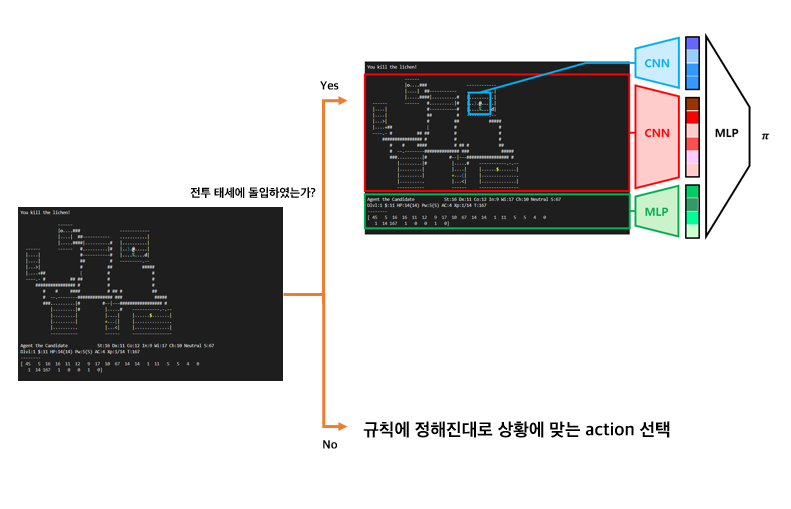

# 열 번째 예제
아홉 번째 예제에서의 전투 규칙은 agent에게 접근해오거나 근접 공격을 하는 적에게는 좋은 규칙이 될 수 있으나, 적이 움직이지 않거나 원거리 공격을 하는 등 특정 상황에서는 큰 손해를 볼 수 있다. 하지만 수없이 다양한 전투 상황이 존재하는 넷핵의 특성상, 모든 전투 상황에 알맞은 규칙을 만드는 것은 불가능에 가깝다. 따라서 열 번째 예제에서는 아홉 번째 예제를 기반으로 하되, 전투에 관한 부분만 강화학습으로 대체하고자 한다. 강화학습 기법은 여섯 번째 예제에서 사용했던 A2C를 사용한다. 아래는 모델의 구조를 나타낸 그림이다.



아홉 번째 예제의 agent 구현을 ```player_agent.py```에 구현하였고, 전투에 관한 부분만 분리하여 ```combat_agent.py```에 구현하였다. 신경망의 구조는 ```a2c.py```에, 학습 데이터 저장을 위한 buffer를 ```buffer.py```에 구현하였다.

```agent.py```는 학습 시 PlayerAgent들이 공통으로 사용할 신경망을 생성하고, ```player_agent.py```의 PlayerAgent를 이용해 action을 정한다. PlayerAgent는 전투 상황일 때는 ```agent.py```에서 생성된 A2C 신경망을 이용해 action을 선택하고, 그렇지 않은 경우에는 규칙에 의해 정해진 action을 선택한다. 만약 A2C에서 action을 선택한 경우에는 ```agent.py```에서는 학습 데이터를 buffer에 저장한다. ```buffer.py```에서 데이터를 저장할 때는 데이터 간의 연관성이 보장되도록 한다. Buffer에 충분한 양의 데이터가 쌓였다면 A2C 학습을 진행한다.

이 예제를 실행하려면 우선 다음 명령어를 터미널에 입력하여 학습을 통해 policy.pt 파일을 생성해야 한다.

```
(nle) ~/NCF2022$ python run.py --run agents.example10 --mode train
```

학습 후 폴더 내에 policy.pt 파일이 생성되었다면, 다음 명령어를 터미널에 입력하여 실행할 수 있다.

```
(nle) ~/NCF2022$ python run.py --run agents.example10